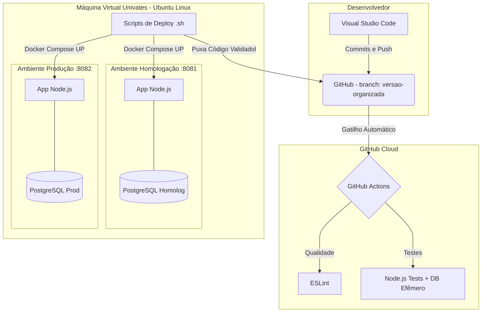

# Arquitetura do Projeto: Integração e Entrega Contínuas (CI/CD)

Este documento detalha a infraestrutura, tecnologias e ferramentas utilizadas para suportar o pipeline de Integração Contínua (CI) e Entrega Contínua (CD) do Projeto Finanças, em cumprimento aos requisitos da disciplina de Gerência de Configuração de Software.

## 1. Esquema e Diagrama de Arquitetura

O diagrama abaixo ilustra o fluxo desde a alteração do código até o seu respectivo deploy na Máquina Virtual, evidenciando a separação dos ambientes de Homologação e Produção.

## 2. Tecnologias Utilizadas

### 2.1. Ambiente e Infraestrutura
- **Máquina Virtual (VM):** Fornecida pela Univates, acessada via SSH remoto.
- **Host Físico:** Servidor interno da instituição.
- **Sistema Operacional (VM):** Distribuição Linux (Ubuntu).
- **Contêineres e Orquestração:**
  - **Docker Engine:** Isolação completa dos ambientes no SO host.
  - **Docker Compose:** Gerenciamento da stack multi-container para levantar a API e o Banco de Dados simultaneamente. (Arquivos `docker-compose.homolog.yml` e `docker-compose.prod.yml`).

### 2.2. Linguagem e Banco de Dados
- **Linguagem de Programação:** JavaScript rodando em **Node.js** (Ambiente server-side) e Vanilla JS/HTML/CSS (Client-side).
- **Banco de Dados:** **PostgreSQL** 15 (Alpine). Cada ambiente (Homologação e Produção) possui um volume e um banco de dados relacional independente, garantindo a separação de dados sensíveis e em fase de testes.

### 2.3. Gestão e Controle de Mudança
- **Ferramenta de Controle de Mudanças (Issues):** **GitHub Issues**. Utilizado para rastrear bugs, documentar novas features solicitadas e vincular o desenvolvimento (Commits e Pull Requests) diretamente a demandas e tarefas do projeto.

### 2.4. Versionamento, Integração e Testes (CI/CD)
- **Versionamento de Código:** **Git** com repositório remoto no **GitHub**.
- **Versionamento de Banco de Dados:** Migrações baseadas em arquivos SQL (`migrations/V00*.sql`) interpretadas por um script runner local (`scripts/migrate.js`) com controle idempotente em tabela `schema_migrations`.
- **Integração Contínua (CI):** **GitHub Actions**. Pipeline configurada em `.github/workflows/ci.yml`.
- **Análise de Qualidade de Código:** **ESLint**, utilizado como barreira de segurança para quebrar a pipeline se o código não seguir os padrões pré-estabelecidos.
- **Testes Automatizados:** Test runner nativo do Node.js (`node --test`), com verificação de asserções em cima de operações CRUD, autenticações e regras de negócio, exigindo o mínimo de 20 testes rodando e validando na nuvem antes do deploy.

### 2.5. Demais Ferramentas e Scripts
- **Automação de Deploy (CD):** Scripts híbridos (`Bash` e `PowerShell`) para conexão remota via SSH, que efetuam o `git pull` de forma segura e garantem a reconstrução das imagens Docker.
- **Gerenciamento de Ambientes:** Módulos e arquivos `.env` dinâmicos. A aplicação foi modularizada para entender, em tempo de execução, em qual porta e em qual banco deve conectar.
- **Serviço de Notificação:** Protocolo SMTP do Gmail, implementado internamente para alertas automáticos do sistema.
